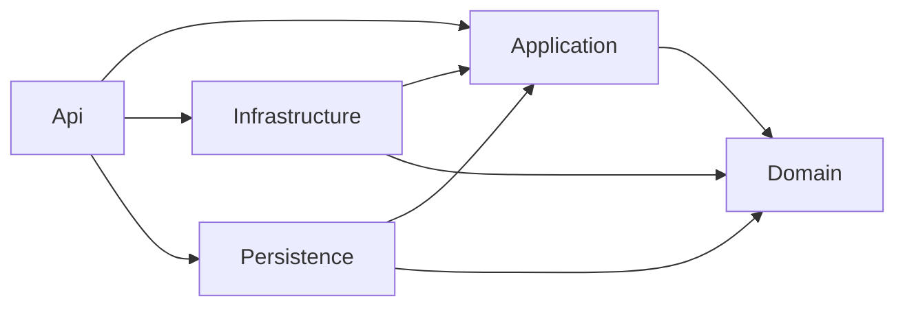

# Clean Architecture

*Last updated: 2026-09-10*

> Project boundaries, dependency direction and component placement in a Clean backend service.

## Layers

| Layer | Project | Role |
|---|---|---|
| Domain | `{Brand}.Domain` | domain values and model |
| Application | `{Brand}.Application` | application contracts |
| Infrastructure | `{Brand}.Infrastructure` | application behavior implementations |
| Persistence | `{Brand}.Persistence` | row access implementations |
| Api | `{Brand}.Api` | executable HTTP host and composition |
| Testing | `{Brand}.Tests.{Type}` | [test tiers](testing.md) |

- must make Domain, Application, Infrastructure and Persistence separate class-library projects.
- must make Api an executable host.
- must declare application interfaces in Application; place row access implementations in Persistence.
- must place other application implementations in Infrastructure.
- must use [solution organization](../architecture.md#solution-organization) for virtual grouping.

---

## Dependency direction

- must keep Domain independent of the service's Application, Infrastructure, Persistence and Api projects.
- may reference shared domain/value contracts from Domain when they introduce no service implementation dependency.
- must not use an SDK package reference to put HTTP or persistence behavior into Domain.
- must allow Application to reference Domain.
- must allow Infrastructure and Persistence to reference Application and Domain, not each other.
- must compose Infrastructure and Persistence in Api.
- must apply [host configuration](../../platform/startup/host-configuration.md) for DI and startup ownership.

---

## Placement

- must place domain entities, enums, constants, extensions and value objects in Domain.
- must place application commands, queries, events and models in Application.
- must keep application `Services/` and `Repositories/` contract-only.
- must place command, query and event handlers in Infrastructure.
- must group foundation behavior under `FoundationServices/`, flows under `ProcessingServices/` or `OrchestrationServices/`.
- may compose peer foundation services without promoting the caller to a flow.
- must place brokers, adapters, provider integrations, factories and registries with their implementation domain.
- must place a settings/options declaration with the implementation that reads it; binding remains host-owned.
- must place row repositories, data contexts, EF configurations and migrations in Persistence.
- must place controllers, requests and DTO models under their domain in Api.
- must place `BackgroundServices/` in the project owning the work.
- must keep `Models/` contents distinct: application models in Application, HTTP DTOs in Api.
- must derive folder names from the declaration owner; this section selects the project, not a second naming vocabulary.
- must allow a service-free component such as an enum in any project that needs to declare it.
- must group these folders by [domain](domain-structuring.md), not in one project-wide role bucket.

---

## Deviation

- may inline the project boundaries as folders for a throwaway spike: about 2 KLOC, no extraction or second consumer.
- must not use that exception for a service that ships, grows or feeds the SDK.
- must apply the [SDK](../../../sdk/sdk.md) or [CLI](../../../cli/cli.md) shape when building those deliverables.
