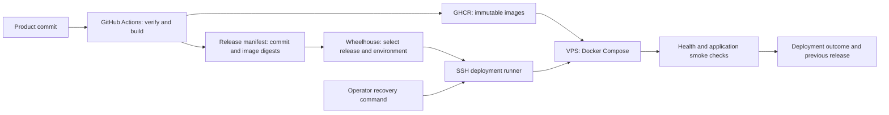

# Deployment readiness — ForeverPin and Wheelhouse

*Last updated: 2026-09-19 11:37 AM*

## Decision and scope

Continue Wheelhouse as the private deployment control plane, with ForeverPin as its first real workload.
Keep the deployment contract usable from an operator's machine so a broken control plane cannot block recovery.
User approved the ownership split on September 19: **GitHub Actions builds; Wheelhouse governs deployment**.
The detailed implementation sequence below is the baseline; the pipeline is not implemented or signed off for production.

- User selected **ForeverPin**, and possibly **Wheelhouse** for infrastructure governance.
- Budget: about **$15/month**; eventual ambition: **3–6 products** on one VPS.
- The inventory covers the local ventures directory and relevant platform/template repositories.
- Detailed readiness checks cover Wheelhouse and ForeverPin; other products received a manifest/deployment inventory.
- Remote repository state, GHCR contents, DNS, production data and a live VPS were not verified.
- Existing product edits were preserved. No provider, billing, or production deployment changes were made.
- Local ForeverPin packaging was implemented and verified after the baseline review.

The portfolio is not uniformly three months stale. ForeverPin has September changes and a September verification record;
Wheelhouse has a working foundation but June planning and deployment files that lag its code.

---

## Verified baseline

| Component | Evidence on September 19 | Consequence |
|---|---|---|
| Wheelhouse backend | Solution builds with cached restore assets; zero errors, 69 warnings | The old June handoff saying the build is broken is stale |
| Wheelhouse tests | 54 unit + 11 integration + 2 migration + 48 HTTP E2E passed; none skipped | Existing registry/auth/image-resolution foundation is reusable |
| Wheelhouse frontend | `npm run typecheck` passed | Type check only; browser and production-image checks remain |
| ForeverPin | Fresh full verifier: 208 backend tests, 4 frontend tests, production frontend build | Current product verification is green |
| Docker | Both ForeverPin images built; the local three-service stack reached healthy state | Local packaging works; production remains unverified |

Wheelhouse build command:

```sh
dotnet build engineering/codebase/wheelhouse.backend-services/Wheelhouse.BackendServices.slnx \
  --no-restore -p:SkipSpaBuild=true --nologo -v:q \
  -m:1 -nodeReuse:false -p:UseSharedCompilation=false
```

Test command, with native permission for runner sockets and Docker:

```sh
dotnet test engineering/codebase/wheelhouse.backend-services/Wheelhouse.BackendServices.slnx \
  --no-build --no-restore -p:SkipSpaBuild=true -m:1 --nologo -v:q
```

Build warnings include cached NuGet vulnerability reports. A fresh restore/security review and clean-image build remain release gates;
this audit did not assess each advisory's exploitability. Passing tests do not prove real GitHub OAuth, SSH deployment or restoration.

Source: [ForeverPin verification](../../workbench/ventures/10x-venture-forever-pin/engineering/operations/verification.md).

---

## Wheelhouse: retain the foundation, finish deployment

### Present in code

- .NET 10 API + React 19 dashboard, served as one application.
- PostgreSQL persistence with embedded SQL migrations.
- GitHub OAuth, cookie authentication and configurable GitHub-login allowlist.
- Product and server registries, validation, repositories and HTTP endpoints.
- GitHub release and GHCR image lookup; recognizes `.github/workflows/publish-docker-image.yml`.
- A deployment entity with product, server, environment and image-tag fields.

Sources: [host registration](../../workbench/wow-two-platform/wow-two-platform.wheelhouse/engineering/codebase/wheelhouse.backend-services/Wheelhouse.Api/Configurations/HostConfigurationExtensions.cs),
[release lookup](../../workbench/wow-two-platform/wow-two-platform.wheelhouse/engineering/codebase/wheelhouse.backend-services/Wheelhouse.Application/Products/Queries/ProductVersionStatus/ProductVersionStatusQueryHandler.cs),
[deployment entity](../../workbench/wow-two-platform/wow-two-platform.wheelhouse/engineering/codebase/wheelhouse.backend-services/Wheelhouse.Domain/Deployments/Entities/Deployment.cs).

### Missing or inconsistent

1. **Execution:** no implemented SSH deployment executor, deployment API/worker, health-gated rollout or rollback path in the inspected source.
2. **Own packaging:** Compose and Dockerfile supply `Data Source=/data/wheelhouse.db`, while the API registers PostgreSQL.
   The supplied container configuration cannot satisfy the current database contract without an override and reachable PostgreSQL.
3. **Publishing:** no image-publishing workflow found locally in Wheelhouse or ForeverPin. The platform pipelines repository contains only a README.
4. **Release model:** lookup resolves a single `ghcr.io/{repo}:{tag}`; the entity still names frontend/API image tags.
   ForeverPin needs two backend services released together. A service-to-image-digest map is a better contract.
5. **Operator access:** empty `AllowedGitHubLogins` deliberately allows any authenticated GitHub user.
   Authentication's default-deny policy does not make that an owner-only configuration.
   Require an explicit owner allowlist and private network access when deploying the control plane.
6. **Build freshness:** the SPA target skips install when `node_modules` exists and uses an incomplete timestamp input list.
   Align it with the existing single-host build convention when repairing packaging.

Sources: [Compose](../../workbench/wow-two-platform/wow-two-platform.wheelhouse/engineering/deployment/docker-compose.yml),
[Dockerfile](../../workbench/wow-two-platform/wow-two-platform.wheelhouse/engineering/deployment/Dockerfile),
[auth settings](../../workbench/wow-two-platform/wow-two-platform.wheelhouse/engineering/codebase/wheelhouse.backend-services/Wheelhouse.Infrastructure/Settings/AuthSettings.cs),
[API project](../../workbench/wow-two-platform/wow-two-platform.wheelhouse/engineering/codebase/wheelhouse.backend-services/Wheelhouse.Api/Wheelhouse.Api.csproj).

The June handoff is a historical checklist, not today's build result.
Keep the useful code; reconcile the planning and packaging against these findings.

---

## ForeverPin: deployment target

| Deployable | Responsibility | Persistent state |
|---|---|---|
| Management API + baked React SPA | Editor, accounts, settings, billing | PostgreSQL; persistent cookie-protection keys |
| Redirect API | Resolve printed links; collect scan events | Same product database; scan queue is currently in memory |
| PostgreSQL | Codes, content, accounts, billing and analytics | Backed-up database storage |

Source: [deployment status](../../workbench/ventures/10x-venture-forever-pin/engineering/deployment/deployment.md).

### Local packaging complete

- One Dockerfile builds the management/SPA and redirect images from one source revision.
- Local Compose runs both hosts with PostgreSQL and persistent cookie-protection keys.
- The release workflow publishes both services with release and `latest` tags.
- The release generator records immutable digests and its generated Compose hash.
- Both health endpoints require database connectivity.
- The SPA reads its public Google audience and redirect origin at runtime.
- The final tree passed the full product verifier and clean image builds.
- Local startup, migrations, routing, health, container replacement, and bundle validation passed.

### Launch work

- Run the first published-release workflow; verify GHCR digests and the attached bundle.
- Preserve the redirect host as an independent service; do not collapse it into the management API to fit an old template.
- Establish management and redirect domains, TLS, trusted proxy handling and the configured public redirect base URL.
- Preserve any already-printed redirect URLs. Existing public/domain state has not been checked in this audit.
- Verify real Google sign-in and Stripe test-mode callbacks through the deployed origin.
- Confirm persistent cookie-protection keys across container replacement.
- Verify migration locking and compatibility with the previous release. Both hosts currently migrate during startup.
- Test deploy-time analytics behavior: the scan recorder drops writes when its bounded queue is full;
  the flush worker has no explicit shutdown-drain path. Do not promise lossless analytics during restart.
- Complete the separately tracked product release gates. Infrastructure readiness does not close unfinished `v0.9` behavior.

Sources: [API project](../../workbench/ventures/10x-venture-forever-pin/engineering/codebase/forever-pin.backend-services/ForeverPin.Api/ForeverPin.Api.csproj),
[redirect startup](../../workbench/ventures/10x-venture-forever-pin/engineering/codebase/forever-pin.backend-services/ForeverPin.Redirect.Api/Configurations/HostConfiguration.cs),
[scan recorder](../../workbench/ventures/10x-venture-forever-pin/engineering/codebase/forever-pin.backend-services/ForeverPin.Redirect.Api/Infrastructure/Analytics/ChannelScanRecorder.cs),
[flush worker](../../workbench/ventures/10x-venture-forever-pin/engineering/codebase/forever-pin.backend-services/ForeverPin.Redirect.Api/Infrastructure/Analytics/ScanFlushBackgroundService.cs),
[product backlog](../../workbench/ventures/10x-venture-forever-pin/engineering/planning/backlog.md).

---

## Proposed deployment contract



### Ownership

- **Product repository:** images, runtime configuration schema, Compose definition, health checks and migrations.
- **Platform pipelines:** shared CI workflow after the first product workflow is proven; retain a thin marker workflow per product for Wheelhouse discovery.
- **Wheelhouse:** desired product/environment/release, operator authorization, execution, audit trail and observed status.
- **Deployment runner:** the same tested operation used by Wheelhouse and operator recovery; no second divergent shell workflow.
- **Host bootstrap:** Docker, private admin access, ingress, storage and backup setup. Keep it independent of Wheelhouse's database/UI.

### Minimum release manifest

Store schema version, product, source commit, release identifier, supported CPU architecture,
service-to-image-digest map, Compose revision, required configuration names, health probes and migration compatibility.
Reference secrets by name, never include their values. Record previous successful manifest and current outcome per environment.
Treat tags as human labels; deploy recorded digests so retry and rollback use the exact same artifacts.

### Execution and recovery

1. Serialize deployments for a product/environment; lock shared schema changes where necessary.
2. Validate inputs, host identity, disk space, image availability, configuration and migration compatibility.
3. Pull all required images before replacing running containers.
4. Record intent durably; perform the controlled rollout and migrations.
5. Verify database readiness, application health and a real redirect smoke request.
6. Mark success only after verification; retain useful, secret-redacted failure logs.
7. Restore prior images on failure only if the resulting schema remains compatible.
   Database restoration is a separate recovery action with an explicit data-loss window, never an automatic image-rollback side effect.

Compose starts containers without automatically proving readiness; use health conditions and application probes.
[Docker startup-order documentation](https://docs.docker.com/compose/how-tos/startup-order/).

Wheelhouse itself must be bootstrappable and updatable with the operator path.
Its process restarting cannot be the only witness of its own deployment outcome.
Existing product containers must keep serving when Wheelhouse is unavailable.

---

## Environments and the $15 host

- Start with production and an **on-demand staging environment**, rather than two always-on copies of every future product.
- Use distinct Compose project names, domains, database names/users, secrets, volumes and external-provider test/live credentials.
- Promote the same verified image digests from staging to production; do not rebuild per environment.
- Keep SPA requests same-origin; environment-specific secrets never enter the frontend bundle.
- A Compose project name separates resources but is not a security boundary or independent failure domain.
  Avoid fixed global `container_name` values and explicitly shared volume names in per-environment bundles.
  [Docker project-name documentation](https://docs.docker.com/compose/how-tos/project-name/).
- Use one ingress service and, initially, one PostgreSQL instance with separate databases and non-superuser credentials per product/environment.
  Production and staging still share the host's CPU, storage and failure risk.
- Prefer an x86-64 host for the initial cut unless all images/native dependencies are verified on ARM.
  Haven's existing scripts explicitly build `linux/amd64`; choosing CAX ARM later requires deliberate image validation.
- An 8 GB class VPS is a reasonable **starting hypothesis** for ForeverPin plus Wheelhouse at light traffic.
  No production memory, traffic or storage measurements were captured. This is not a capacity guarantee for six products.
- Build on CI, not the VPS. Measure memory, CPU, disk growth and redirect latency before admitting more workloads.
- Apply container resource limits, log rotation, bounded retention and low-disk alerts.
- Count tax, IPv4 and independent backup storage in the $15 total; previous provider quotes were not revalidated here.
- Keep routine full-stack preview environments local until demand justifies another always-on copy.

Initial always-on shape: ingress + PostgreSQL + ForeverPin management + ForeverPin redirect + private Wheelhouse.
No Redis, queue broker or telemetry database is required by the inspected initial deployment contract.

---

## Secrets, backups and governance

- Start with scoped runtime secrets delivered through protected host files or Compose secret mounts.
  Existing applications must explicitly read mounted secret files; `_FILE` variables are not universally supported.
  Compose mounts do not themselves encrypt the backing host file.
  [Docker secrets documentation](https://docs.docker.com/compose/how-tos/use-secrets/).
- Keep decryption/recovery keys outside the VPS and outside Wheelhouse's own database.
- Secrets Vault is a separate unfinished product; do not make it a prerequisite for recovering the initial applications.
- Use a deployment credential with pinned SSH host identity; treat Docker access as privileged even if the SSH user is not named root.
- Keep SSH/admin access private; expose only intended web ingress. Keep PostgreSQL off the public interface.
- Back up product databases, persistent uploads, control-plane state, necessary configuration and recovery keys appropriately.
- Keep an encrypted backup outside the VPS provider/account; rehearse restoration into an empty local environment.
- Choose and record acceptable recovery time and data loss before public launch. Daily backups alone imply up to a day's data loss.
- Add external uptime checks for an actual redirect, plus backup-age and disk-capacity alerts.
- Track provider, renewal cost, payment method and billing notifications in the host inventory.
  Deployment automation cannot prevent account suspension caused by unpaid invoices.
- Keep paid AI/scraping jobs disabled by default for new databases and staging. A paused old database is not a safe default for a fresh one.

---

## Portfolio inventory

This is a deployment-shape inventory of local files, not a claim that every prototype works or needs hosting.
Dependencies declared by a template may be unused. Uncommitted edits mean the inspected tree can differ from the published repository.

| Local folder/product | Observed shape | Disposition |
|---|---|---|
| `10x-venture-forever-pin` | .NET 10, React 19, PostgreSQL, management + redirect hosts | Selected pilot |
| `10x-ven-haven` | .NET 9/10 projects, multiple React apps, PostgreSQL/Supabase, browser extraction | Later, dedicated recovery review |
| `10x-ventures-prism` | React/Vite/Three.js browser app | Static-host candidate |
| `whiteout` | React/Vite/Three.js browser apps and shared engine | Static-host candidates; validate large assets |
| `10x-ventures-transcript-forge` | .NET 10 + React, PostgreSQL foundation, `yt-dlp`, external Groq STT | Later; external-cost and job limits |
| `sift` | .NET 10 + React, SQLite, Docker/Compose scaffold | Prototype; readiness unverified |
| `ventures.arcade` | .NET 10 + React, SQLite, Docker/Compose scaffold | Prototype; readiness unverified |
| `ventures.museums-gallery` | .NET 10 + React, SQLite, media, Docker/Compose scaffold | Later; verify asset persistence |
| `ventures.tnis` | .NET 10 + React apps, PostgreSQL references, substantial local datasets | Separate product/data-publication review |
| `ventures.tnis-mintrans` | .NET 10 + Vue, SQLite, Docker/Compose | Separate ministry handoff scope |
| `track-2-transportbrain` | .NET backend + React studio, PostgreSQL references | Hackathon lineage; not a default SaaS launch |
| `tbs.demo` | React/Vite app | Static demo candidate |
| `acquisition-explorer-poc` | React/Vite app | Static prototype candidate |
| `trademark-watcher-poc` | Small .NET 10 source tree; no deployment files found | Product implementation review needed |
| `pdf-editor` | .NET 9 source; no frontend/deployment bundle found | Product implementation review needed |
| `10x-fin-nt` | One .NET 10 project among finance/data documents | Treat as tooling until a hosting need is shown |
| `your-pocket-doctor` | .NET 9 + Python identity, existing service deployment workflows | Older mixed-service application; separate recovery |
| `10x-venture-forever-pin-promo` | React/Remotion promo workspace, no independent `.git` | Build asset, not another server product |
| `prism-wt-c` | Residual Vite files, no independent `.git` | Do not count as another deployment |
| `10x-venture-whiteout-presets`, `10x-ventures` | No application manifests found in scan | Content/planning, not allocated runtime |
| `transcript-forge` | Documentation-only local tree | Distinguish from the implemented prefixed repository |
| `ventures.city-vision` | Documents, SVG and scripts; no app manifests | Concept/prototype |
| `ventures.fun-vault`, `ventures.hijinx` | Markdown/content in inspected trees | No deployable app established |

Haven particularly needs a new deployment bundle: `ship-all.sh` still calls the old `BrowserExtractor` path,
while the inspected service is `RenderedContentExtractor`. Existing service scripts push `latest`, replace containers
over root SSH, and use host networking. Preserve data and disabled paid-job settings before any eventual restart.
Source: [Haven shipping script](../../workbench/ventures/10x-ven-haven/platform/deployment/ship-all.sh),
[Supply operations](../../workbench/ventures/10x-ven-haven/platform/src/backend-services/Haven.Channels.Supply/ops.sh).

The product template has Docker/Compose scaffolding but uses `npm install` without a committed lockfile in its Docker recipe.
It is not yet the reproducible release template to copy unchanged.
The existing Secrets Vault publish workflow is a useful starting example, but it has no test job and no explicit multi-architecture build.

---

## Proposed implementation sequence and acceptance

| Stage | Work | Acceptance evidence |
|---|---|---|
| 1. Packaging | ForeverPin's two images; Wheelhouse PostgreSQL packaging; frozen dependencies; runtime config contract | Clean builds, local Compose smoke, restart retains state, no secrets baked into images |
| 2. Release | Tested product workflow; GHCR digests; release manifest; shared workflow extraction | Same verified commit produces both ForeverPin images; reproducible staging-to-production promotion |
| 3. Execution | Provider-neutral SSH runner, locking, deploy state, health checks, failure handling, recovery command | Deploy two releases to disposable target; recover from unhealthy release; repeat safely |
| 4. Wheelhouse integration | Environment + multi-service release model, runner integration, private access, owner allowlist | Select release/environment; observe real outcome; recovery works while Wheelhouse is stopped |
| 5. Public launch | Chosen host, DNS/TLS, real provider callbacks, tested backups, monitoring, completed ForeverPin product gates | Working public redirect/editor, restore drill, measured headroom, costs within approved budget |

Keep domain purchasing, automatic VPS provisioning, full Secrets Vault integration, multi-host orchestration and broad UI redesign
outside this initial deployment slice. They can be added after ForeverPin proves the contract.
Do not require a React-to-Vue migration or a portfolio-wide SDK upgrade to ship this pipeline.
Fix SDK defects at their owner when one actually blocks the agreed slice.

Immediate implementation boundary: **repeatable local packaging for ForeverPin and Wheelhouse**, not a new server purchase.
No estimate of completion time is asserted; the missing deployment executor is substantive new work.
