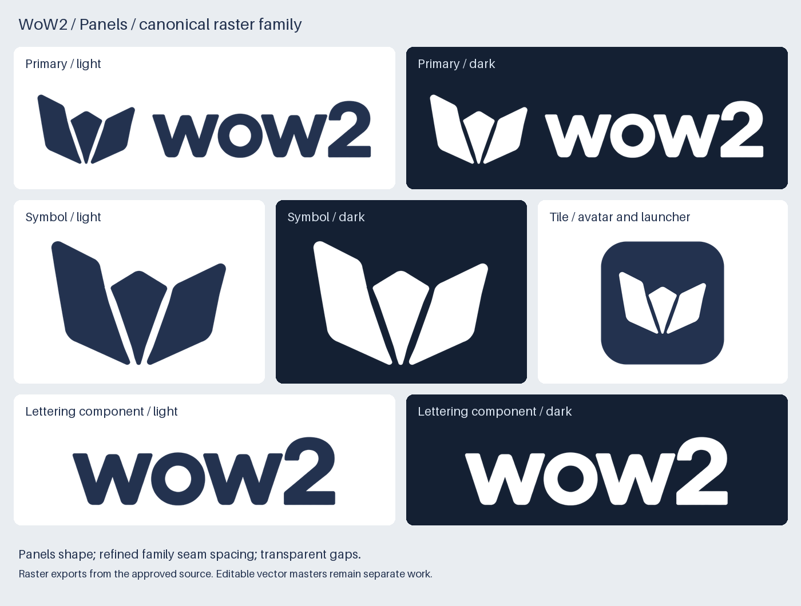
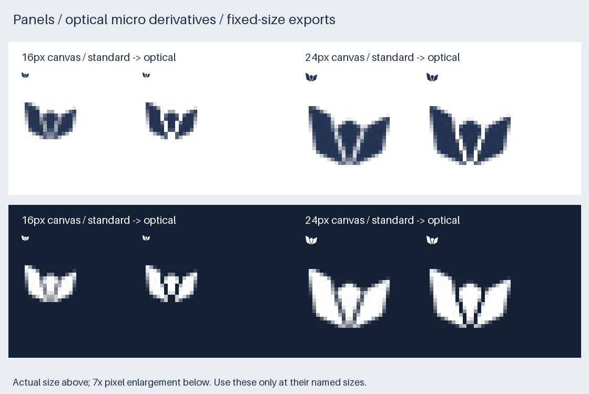

# WoW2 brand

*Last updated: 2026-09-29*

## Status

- ✅ Panels is the user-confirmed WoW2 shape.
- ✅ Horizontal, standalone and tile compositions are saved from that approved artwork.
- ✅ The user approved the final internal seam spacing shared with Wheelhouse.
- ✅ Wheelhouse endorsements reuse the exact saved WoW2 horizontal assets.
- ✅ All eleven logo PNGs, including fixed-size micro derivatives, are generated and saved.
- ⬜ Editable vector masters and application integration are separate work.

The shared [logo system](../../../conventions/design/identity/logo-system.md) owns composition patterns.
This guide owns WoW2's artwork and usage values. Consumer ventures remain outside the family system.

## Identity

Three gathered panels suggest separate contributions forming one shared build platform. The asymmetric heights,
inward seams and rounded lower corners are the identity. Preserve those relationships rather than turning the
panels into an emoji, an ordinary grid or three equal rectangles.

The [seam-spacing review](seam-spacing.md) records the applied refinement: wider internal seam bodies,
with the original outer silhouette, rounded tips and lettering retained. Wheelhouse provides the spacing
reference; its boat geometry and gray lower facet stay unchanged.

The lettering is the lowercase `wow2` artwork from the approved card. It is a raster component, not a font
specification. Versions and environments belong in adjacent UI text, never inside the permanent logo.



## Compositions and files

All artwork below is RGBA PNG. Dimensions include export padding.

| Composition | Light surface | Dark surface | Dimensions | Use |
|---|---|---|---|---|
| Primary horizontal | [Navy](panels/wow2-primary-navy.png) | [White](panels/wow2-primary-white.png) | 864 × 192 | Default header, docs, introductions |
| Standalone symbol | [Navy](panels/wow2-symbol-navy.png) | [White](panels/wow2-symbol-white.png) | 678 × 485 | Compact navigation, diagrams |
| App tile | [Navy carrier with white symbol](panels/wow2-tile.png) | Same asset | 400 × 400 | Avatar, launcher, square card |
| Lettering component | [Navy](panels/wow2-wordmark-navy.png) | [White](panels/wow2-wordmark-white.png) | 663 × 186 | Source component; exceptional wordmark-only use |

WoW2 has no self-endorsement. An ecosystem product may place `by` followed by the exact primary horizontal
asset beneath its own identity. Neither the symbol alone nor retyped `wow2` replaces that parent artwork.
There is no current placement requiring a stacked composition.

## Color and surfaces

| Token | Value | Placement |
|---|---|---|
| Navy | `#23324F` | Artwork on white or a pale neutral; opaque app-tile carrier |
| White | `#FFFFFF` | Artwork on navy or another sufficiently dark solid surface |

The navy and white pairs share identical alpha masks. Seams and counters stay transparent. White inside the
tile is intentional artwork; the navy carrier is intentionally opaque. Outside the rounded carrier remains
transparent. Avoid arbitrary recolors, effects, gradients and busy photographic backgrounds.

## Size and clear space

- Standard symbol: at least **24 pixels of visible width**. The saved PNG includes eight pixels of padding
  on each side; that padding is not the clear-space requirement.
- Primary horizontal: at least **24 pixels total image height**, using proportional scaling.
- Tile: at least **64 × 64 pixels**, reviewed as a square avatar. Native operating-system icon masks,
  safe areas and packaging remain to be checked when a target platform is selected.
- Clear space: at least **one quarter of the visible panel symbol's height** around the whole composition.
  Surrounding layout provides this space; the PNG's transparent border does not supply it automatically.
- Endorsements: preserve the horizontal asset's aspect ratio and internal spacing. The primary minimum
  still applies to the parent artwork. Omit the whole endorsement when the space is too small.

The [size review](size-review.png) shows actual pixels on light and dark surfaces. At 16 and 20 pixels
of visible width, ordinary downsampling still merges panels. At 24, 32, 48 and 64 pixels, the refined symbol
retains three separate panels at the review threshold of alpha ≥ 128. The primary is readable at 24 pixels
total height on both reviewed surfaces. These measurements support the visual
review; it is not a substitute for recognition testing in a product.

### Optical micro derivatives

The following conditional derivatives open the two internal seams at fixed pixel sizes. They retain the
source contours and clear weaker touching seam pixels; they do not replace the standard master.
They are included in the saved final export family. Application integration is separate.

| Fixed canvas | Light surface | Dark surface | Visible symbol width |
|---|---|---|---|
| 16 × 16 | [Navy](panels/wow2-symbol-micro-16-navy.png) | [White](panels/wow2-symbol-micro-16-white.png) | 14 pixels |
| 24 × 24 | [Navy](panels/wow2-symbol-micro-24-navy.png) | [White](panels/wow2-symbol-micro-24-white.png) | 22 pixels |

Use only at the named canvas size; arbitrary resampling can close the gaps again. A 20-pixel placement
can center the 16-pixel asset at its native size. Below 16 pixels, use a text or contextual identification
instead. High-density display exports require a separate render review, not a claim of new raster detail.



## Reproducible source and export

- Approved raster card: [panels-approved.png](source/panels-approved.png), 1254 × 1254 pixels.
- SHA-256: `345550fdb7b72576649a3601651249fbbdb8f178bd8dafee6072fe69aec5347a`.
- Exporter: [export-wow2-logos.py](../../../scripts/brand/export-wow2-logos.py).
- Inventory, source crops, seam transforms, output hashes and size measurements: [manifest.json](manifest.json).
- Wheelhouse comparison input: [wheelhouse-gap-reference.png](source/wheelhouse-gap-reference.png), copied exactly.
- Verified dependencies: Python 3, Pillow 12.3.0 and NumPy 2.3.5.

```sh
python3 scripts/brand/export-wow2-logos.py
python3 scripts/brand/export-wow2-logos.py --output-dir /tmp/wow2-brand-replay
```

Run from the workspace root with those dependencies installed. The exporter checks the approved source hash,
extracts the symbol and lettering, removes the page background, normalizes the ink to the palette, widens
only the recorded internal seam corridors and composes the family without font substitution or raster upscaling.
The seam body is `662 / 24 = 27.58` source pixels wide, measured perpendicular to each seam.
Smooth transitions preserve the source tips and corner geometry. The horizontal composition uses a 176-pixel symbol,
146-pixel lettering height and 44-pixel gap before adding eight-pixel export padding. The tile has a 384-pixel
carrier, 80-pixel corner radius and 272-pixel-wide white symbol.

The exporter writes eleven artwork PNGs, four review sheets and the manifest. Review-sheet captions use
Pillow's bundled font, independently of host fonts. Replay compares the saved files against a separate output
directory. These are canonical **raster** assets; no editable vector source is claimed.

## Product endorsements

[Wheelhouse's brand guide](../../../workbench/wow-two-platform/wow-two-platform.wheelhouse/product/brand/brand.md)
owns its product composition. Its vendored navy and white parent assets match this guide's files byte for byte.
The Wheelhouse compositor scales those assets proportionally and positions a separate neutral `by` label.
Its default logo, standalone symbol and tile remain unendorsed.

If the approved parent artwork changes, update the canonical source, exports, manifest and every vendored
parent copy together. An automated regeneration may export approved artwork; it must not invent a new parent
shape or approximate its lettering.
