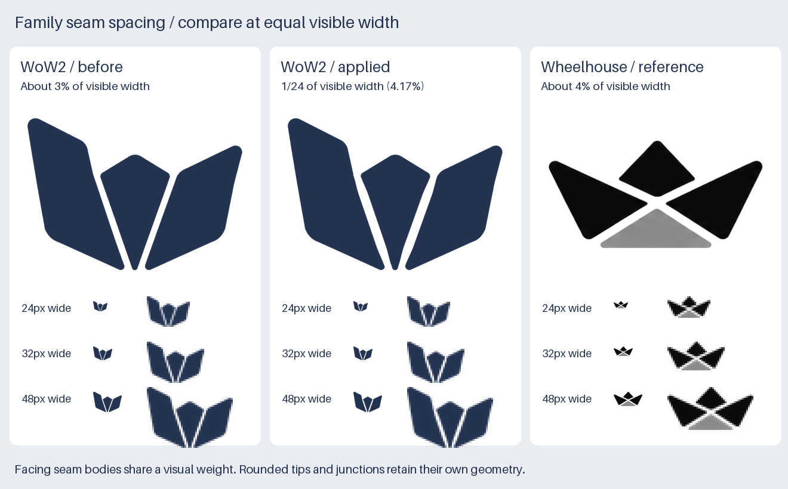

# Family seam spacing

*Last updated: 2026-09-29*

## Decision

Wheelhouse's more open separators are the reference. WoW2's two internal seams are widened modestly;
Wheelhouse's boat, gray facet, lettering and tile geometry remain unchanged.

For a segmented family symbol, the shared starting weight is **one gap unit per 24 units of maximum
visible extent**. Both current marks are wider than tall, so their width supplies that extent. Measure across
the seam, perpendicular to its direction, within the straight body. Rounded ends and intersections keep their
own geometry. The [logo convention](../../../conventions/design/identity/logo-system.md#internal-separators)
owns the reusable rule; this document records its first application.

## Comparison

| Artwork | Visible bounds | Perpendicular body gap | Gap / width | Gap / height |
|---|---|---|---|---|
| WoW2 before refinement | 662 × 469 | About 19.2–20.2px | 2.9–3.1% | 4.1–4.3% |
| WoW2 applied | 662 × 469 | Measured about 27.57px; target 27.58px | 4.17% | 5.88% |
| Wheelhouse reference | 292 × 147 | About 11.3–11.9px | 3.9–4.1% | 7.7–8.1% |

Copying a raw pixel width would ignore the different source resolutions. Copying Wheelhouse's percentage
of height would widen WoW2 to roughly 37.5 source pixels. That candidate made the center panel too thin.
The selected weight gives both symbols comparable seams in the square slots where standalone symbols appear.
It also retains more of WoW2's center panel at large sizes.

The convention's optical tolerance is a starting range, not a pass/fail algorithm. No gap rule forces
lettering counters, symbol-to-name spacing, export padding or external clear space to share this dimension.
It does not require a solid product symbol to acquire seams.

## Measurement

The original seam measurements use the alpha ≥ 128 contours of the saved RGBA assets. Each facing straight
edge is fitted independently; its opposing edge is intersected along the first edge's normal. The sampled
bodies exclude rounded caps and Wheelhouse's wider X-shaped intersection. Original edge-fit residuals are
at most 0.12 source pixels; the table rounds the results to avoid implying vector precision.

The applied WoW2 transform fits both seam centers in the original tight crop. Each cut reaches a constant
`662 / 24` width through the straight body, with smooth transitions back toward the source seam near its ends.
Only alpha inside those two corridors can decrease. Pixels outside them retain the source alpha, and the
source image, symbol bounds, three-panel structure, typography and palette remain intact.

The [manifest](manifest.json) records the fitted centers, taper intervals, source hashes and final export
hashes. The [exporter](../../../scripts/brand/export-wow2-logos.py) reproduces both the family and this review
sheet. Its comparison input is an exact copy of Wheelhouse's unchanged standalone mark.

## Size review

| WoW2 visible symbol width | Before: separate panels | Applied: separate panels |
|---|---|---|
| 16px | 1 | 1 |
| 20px | 1 | 2 |
| 24px | 1 | 3 |
| 32px | 3 | 3 |
| 48px | 3 | 3 |
| 64px | 3 | 3 |

Counts use connected regions at alpha ≥ 128, without tiny-component filtering, and agree for navy and white.
They support the [visual review](size-review.png); recognition still depends on placement and context.
WoW2's standard symbol minimum becomes **24px visible width**. Its primary minimum becomes **24px total
image height**, inspected on both light and dark backgrounds. The fixed 16px micro variant remains necessary
for smaller slots; changing the entire identity to satisfy a 16px raster would over-open larger artwork.

## Cascade

The applied seams propagate to WoW2's navy and white primary, standalone, tile and micro derivatives.
The separate lettering components retain their exact bytes. Wheelhouse's vendored parent assets and its
three optional endorsements are regenerated from those exact new parent PNGs. Wheelhouse's seven unendorsed
exports remain byte-identical.
