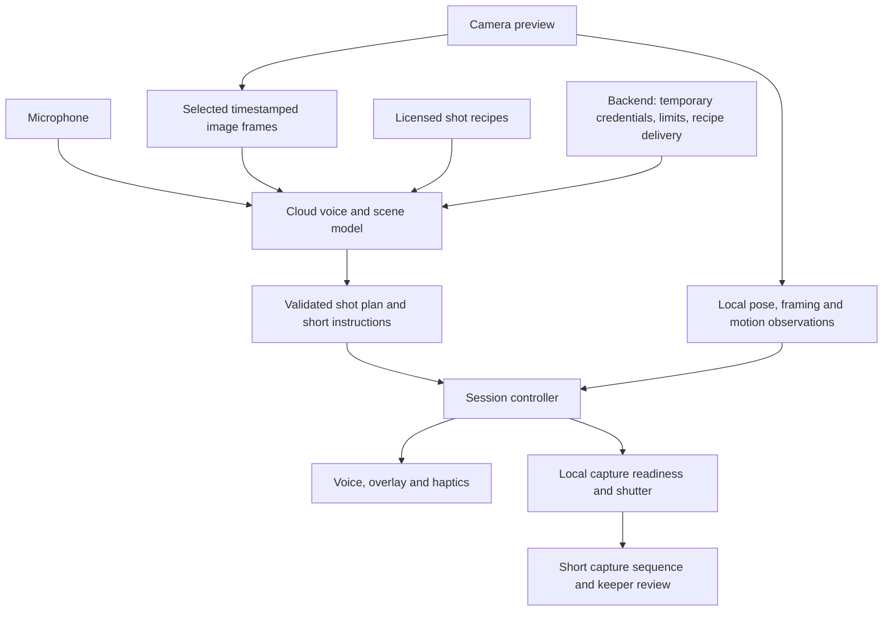

# AI Photo Director — Market and iPhone Build Analysis

*Research date: 2026-09-10*

> Decision: validate a voice photo director for duos on iPhone. The category already has direct competitors;
> the opportunity depends on better photographs and an easier shoot, not on being the first AI pose coach.

## Scope and evidence

- Assumption: “duos” means two people in the photograph. One person photographing their partner is a separate mode.
- Initial audience: friends and couples making social photos in everyday locations. Geography and budget remain unspecified.
- Evidence: official product pages, US App Store listings, provider documentation, and RevenueCat's subscription dataset.
- Competitor features below are advertised capabilities, not independently tested performance.
- Downloads, revenue, funding, active use, and willingness to pay are unverified unless explicitly stated.
- This analysis supersedes the market assessment and launch recommendation in [the April concept](pose-coach-spec.md).
- No app or model benchmark was run. Architecture, schedule, pricing experiments, and thresholds below are proposals.

---

## 1. Does this market already exist?

Yes. Small apps cover remarkably close versions of this concept, and Google offers coaching inside its camera.
The research establishes product overlap; it does not establish a large successful standalone business in this niche.

| Product | Advertised overlap | Evidence and implication |
|---|---|---|
| [Vouve](https://apps.apple.com/us/app/vouve-ai-pose-coach-cam/id6769137009) | iPhone; 43 poses; couples; voice; photographer angle guidance; pose tracking; automatic shutter | Closest verified store listing. US prices: $4.99/week, $39.99/year, $49.99 lifetime. Insufficient ratings for a review overview at inspection. |
| [FrameMe](https://apps.apple.com/us/app/frameme-couples-photography/id6760603586) | iPhone; lighting, distance, composition; prompts for photographer and subject | Free listing with one rating. Mostly partner-as-photographer positioning. Its promotional usage claim is not verified adoption evidence. |
| [SnapStance](https://snapstance.com/) | Pose overlay; phone tilt; composition; automatic capture; local Apple Vision processing | Public product site verified; linked App Store page could not be retrieved. Availability and commercial traction remain unverified. |
| [PoseOverlay](https://poseoverlay.com/) | Browser camera; 108 poses; voice; body tracking; couple category; simplified photographer mode | Advertises a free entry point. A template library plus spoken instructions is already offered without installing an app. |
| [Fashion Camera](https://www.whattowearfashioncamera.app/) | Live voice direction; expressions; personal calibration; automatic capture; photographer personas | Public marketing site verified. Personality and expression coaching are also advertised elsewhere; neither is an exclusive claim. |
| [Second Shooter](https://secondshooterai.com/) | Scene-specific posing prompts; voice cues; saved pose library | Targets professional wedding photographers; site advertises free beta. Continuous visual verification was not established. |
| [Google Camera Coach](https://support.google.com/pixelcamera/answer/17367411?hl=en) | Scene analysis; creative suggestions; step-by-step capture guidance | Built into Pixel Camera on supported devices; needs connectivity and uses the rear camera. It is a platform competitor, not a startup. |

### Competitive interpretation

- Pose references, voice cues, two-sided guidance, and auto-capture are existing features.
- Google can distribute general photography advice through the camera people already use.
- A new app must overcome installation, permissions, switching cameras, and speaking aloud in public.
- Small review counts indicate limited public traction evidence, not proof that competitors have no users.
- Paid listings establish price anchors, not actual willingness to pay or attractive retention.
- Photo editors and synthetic portrait generators compete for the desired result, but solve a different capture workflow.
- Pinterest-style inspiration and a helpful friend remain practical alternatives even without AI.

**Inference:** a focused consumer business is plausible. Evidence does not yet justify a venture-scale market claim.
Generic “AI photo app” market estimates would mix editing, generation, and real camera coaching and overstate this opportunity.

---

## 2. Where can a new product win?

### Recommended initial promise

**“Turn this place into three photos you both want to post.”**

Treat this as a measurable promise to test, not launch copy with a guaranteed outcome.
Start with duo portraits in daylight: friends or couples, one location, three achievable shot ideas.

The proposed advantage is a connected sequence:

1. Understand the place, light, available space, clothing, and the user's intended mood.
2. Offer three achievable references, or select one when asked to choose.
3. Direct the photographer and each subject with short, observable instructions.
4. Check whether the instruction worked before giving another one.
5. Capture a short sequence at the useful moment and help choose a keeper.

The distinguishing hypothesis is better situational judgment and execution across this sequence.
Neither “voice” nor “creative personality” alone differentiates it from the products above.

### Creativity has several parts

- Concept: find a visual idea that works in the actual location.
- Composition: choose camera position, distance, background, crop, and perspective.
- Direction: translate that idea into something two non-models can comfortably do.
- Timing: create an interaction and catch the useful instant.
- Taste: recognize which result matches what the user wanted.

A model can propose concepts. A product needs tested shot recipes and feedback to execute them reliably.
Exact skeleton matching is a weak proxy for a natural or memorable photo.

### Audience tradeoffs

| Segment | Why it could work | Main constraint |
|---|---|---|
| Friends/couples on outings | Clear discomfort; visibly demonstrable improvement | Both in frame requires a tripod, support, or another photographer |
| Outfit and lifestyle creators | Potentially repeated weekly use | Solo workflows and wardrobe presentation become more important |
| Travelers | Distinct locations create recurring inspiration needs | Connectivity, short attention, and seasonal use |
| Professional photographers | Established spending on workflow tools | Higher creative expectations; different capture equipment |

Start with duos because that is the original product example. Expand only after repeated successful shoots.
Keep the architecture capable of more people, without making “any situation” the initial quality promise.

### Defensibility and distribution

- Own a licensed library of shot recipes with executable instructions, not only reference pictures.
- Learn which instructions produce keepers across settings and bodies, with opt-in evaluation data.
- Develop creator-authored collections whose quality can be demonstrated in actual shoots.
- Retain user taste through chosen and rejected references rather than inferred personality labels.
- Promote a repeatable video format: ordinary location → spoken direction → real result.
- Test small creators and photography educators as acquisition partners before paying for broad ads.
- Measure viewer → install → completed shoot → repeat shoot → paid conversion by channel.

These are potential advantages to build. There is no established proprietary advantage at the idea stage.

---

## 3. Business model and market validation

RevenueCat reports 12-month annual-plan subscriber retention of 21.1% for AI apps versus 30.7% for non-AI apps
in its 2026 dataset. This is cross-category subscription evidence, not a forecast for camera coaching.
It supports testing repeated utility instead of assuming initial excitement becomes a subscription.
[RevenueCat research](https://www.revenuecat.com/state-of-subscription-apps)

### Pricing experiments

- Free: local guidance plus a small cloud-coaching allowance sufficient for a complete successful shoot.
- Occasional users: test a clearly limited outing/session pack at $3.99–$5.99.
- Frequent creators: test $7.99–$9.99/month with an explicit allowance.
- Annual pricing: test only after repeat use is demonstrated; Vouve's $39.99/year is a competitive reference.
- Lifetime purchase: suitable only for defined local features, not unlimited recurring cloud inference.

All proposed prices are hypotheses in USD. Store fees, taxes, refunds, and acquisition costs must be included later.
Do not copy a weekly subscription solely because a competitor lists one.

### Bottom-up business scenario

At a hypothetical $40 annual price, 1,000 paying customers produce $40,000 gross annual billings;
10,000 produce $400,000. These are arithmetic scenarios, not market-size or acquisition forecasts.
The unknown is how many reachable people both benefit and return often enough to pay.

### Validation before a broad build

Recruit 20 duos for observed shoots in a cafe, street, and park or equivalent accessible locations.
Include height differences, loose clothing, glasses, different skin tones, and people uncomfortable posing.

Compare three conditions, balancing their order to reduce learning effects:

1. Their normal camera workflow.
2. A reference-only guide or the closest usable competitor.
3. The proposed live director prototype.

Use equal shooting time. Have participants select keepers and independent reviewers compare results without app labels.
Track time to first keeper, keeper rate, instruction failures, embarrassment, and desire to use it again.
Invite participants to a second outing within 14 days; check actual return and purchase behavior.

Suggested pilot targets, not statistical proof:

- At least 14 of 20 duos prefer the guided results under equal-time comparison.
- Median time to first keeper is under two minutes.
- At least 8 of 20 return for another shoot without individual chasing.
- At least 5 of 20 buy a clearly priced pack or subscription after a useful trial.

Failure diagnosis matters: liked photos with no return suggests episodic pricing;
repeated use with poor conversion suggests the free alternatives or price are stronger than expected.
Twenty duos justify another experiment, not a product-market-fit declaration.

---

## 4. Is iPhone the right starting platform?

**Recommendation: native iPhone for the pilot.** It concentrates camera, audio, and performance work on one platform.
The assertion that most content creators use iPhones was not established by this research; do not use it as a market fact.

Use Swift/SwiftUI with AVFoundation camera capture, Vision for local observations, Core Motion for phone orientation,
and PhotoKit for saving. Apple's AVCam sample demonstrates the capture and save foundation.
[Apple AVCam](https://developer.apple.com/documentation/avfoundation/avcam-building-a-camera-app)

- A native prototype gives direct control over camera frames, audio routing, overlays, and capture scheduling.
- React Native remains possible, but frame processing and camera/audio integration still need native work.
- A .NET backend can issue temporary sessions and serve shot recipes; it need not process every frame.
- A 2D silhouette overlay does not require ARKit. Add world tracking only when a demonstrated feature needs it.
- Start testing on an older supported iPhone and a recent Pro; choose the minimum device after thermal and quality tests.
- Benchmark actual photos against Apple's Camera in daylight, indoor light, and backlight.
- Do not assume a custom camera automatically reproduces every Apple Camera processing mode or output quality.

There are two distinct duo flows:

- **Two people in frame:** supported phone or third photographer; spoken person-specific instructions; hands-free capture.
- **One photographs the other:** rear-camera coaching for the phone holder and subject; easier setup, different promise.

For two people in frame, a rear camera on a tripod gives no convenient preview to the subjects.
Choose references before they walk into position and use audible readiness cues. A watch or second-screen remote can wait.

---

## 5. Architecture: creative planning plus local timing

The cloud proposes and adapts the shot. The phone observes movement and controls capture.
Network round trips and sparse model frames cannot reliably time a blink, jump, or fleeting expression.

### Two processing speeds

| Layer | Proposed behavior | Responsibility |
|---|---|---|
| Local observation | Target 10–15 analyses/second, adjusted for heat | Body positions, frame boundaries, phone movement, observation confidence |
| Cloud direction | Event-driven images, initially around one every 2–3 seconds | Scene interpretation, concept selection, dialogue, adaptation |
| Capture | React to fresh local observations | Stable readiness, user-armed capture, bounded sequence, cooldown |

These rates are engineering targets, not measured performance.
Google's Live documentation specifies JPEG input at up to one frame per second; OpenAI's compared models accept images,
but do not list native video input. Neither should receive a raw 30 FPS camera stream in this design.
[Gemini Live transport](https://ai.google.dev/gemini-api/docs/live-api),
[OpenAI realtime modalities](https://developers.openai.com/api/docs/models/gpt-realtime-2.1-mini)

### Session controller

Use explicit states: `understand → choose → set_camera → place_people → refine → capture → review`.

- Proposed model tools: `select_recipe`, `suggest_adjustment`, `request_fresh_frame`, `arm_capture`, `finish_shot`.
- Validate arguments and state transitions in application code; discard advice based on stale frames or old plans.
- Give one correction at a time and wait for an observable response.
- Cancel queued speech when the user interrupts or the camera changes substantially.
- Rate-limit repetitive nudges; allow silence while people are executing the instruction.
- Use neutral labels chosen by users or anchored descriptions such as “person in blue.”
- Keep each person's tracked identity stable; pause specific advice when tracking becomes uncertain.
- Distinguish the subject's left/right from the image's left/right and account for mirrored previews.
- Let the model request capture readiness; let local code decide when an armed capture can fire.

### Pose and expression limits

Apple Vision provides 2D body landmarks. Its documented 3D request returns only the most prominent person,
so it is not a ready-made solution for two complete 3D skeletons.
[Apple 2D pose guide](https://developer.apple.com/documentation/vision/detecting-human-body-poses-in-images),
[Apple 3D limitation](https://developer.apple.com/documentation/vision/identifying-3d-human-body-poses-in-images)

- Validate two-person 2D observation and identity association in the technical spike.
- Crossing arms, hugs, occluded legs, and similar clothing are explicit failure cases.
- Skeletons alone cannot establish whether a smile looks natural or a hand gesture is attractive.
- Use face observations and optional post-capture review as additional signals, with uncertainty.
- Prefer visible instructions like “leave a gap between your arm and waist” to unsupported precise angle claims.
- Do not infer exact distance in centimetres from an uncalibrated ordinary frame.
- Replace a rigid match threshold with recipe-specific tolerances, confidence, framing, and user intent.
- Start with static or slow-action shots. Jump timing and fast action need a separate capture experiment.
- Capture full-resolution photographs; do not save a low-resolution cloud preview as the final image.

### Reference library

Begin with 20–30 original or licensed recipes, each containing a reference, setting constraints, camera guidance,
person roles, ordered cues, acceptable pose variation, and capture conditions.
Commission or recreate references with appropriate permissions; avoid building the catalogue from scraped social images.

Use three choices rather than a feed. Offer “choose for us.”
Generated previews can be an experiment later; unrealistic anatomy or lighting would make them poor execution targets.
The model selects and adapts recipes instead of improvising every instruction from an empty prompt.

---

## 6. Which AI provider?

**Prototype recommendation: compare Gemini 3.1 Flash Live Preview with GPT-Realtime-2.1 Mini.**
Use GPT-Realtime-2.1 as a higher-cost quality reference.
Choose a production provider from recorded shoot outcomes and measured latency, not a generic model ranking.

| Candidate | Documented fit | Main tradeoff |
|---|---|---|
| `gemini-3.1-flash-live-preview` | Audio/image/video inputs; spoken output; function calls | Preview lifecycle; WebSocket audio handling; context billing needs measurement |
| `gpt-realtime-2.1-mini` | Image and audio inputs; spoken output; function calls | Sampled images rather than native video; creative quality must be tested |
| `gpt-realtime-2.1` | Multimodal voice with configurable reasoning | Higher price; extra reasoning can add latency |
| Local observations + scripted/native speech | Routine positioning cues and capture readiness | Cannot provide the full open-ended creative conversation |

Sources: [Gemini model](https://ai.google.dev/gemini-api/docs/models/gemini-3.1-flash-live-preview),
[OpenAI Mini](https://developers.openai.com/api/docs/models/gpt-realtime-2.1-mini),
[OpenAI full model](https://developers.openai.com/api/docs/models/gpt-realtime-2.1).

Gemini is the initial integration candidate because the documented Live interface directly fits streamed visual context
and conversation. This is an implementation choice, not a claim that it gives better photographic advice.
The mini model is an important alternative because its image pricing is low; Gemini is not automatically cheaper in practice.

Do not start by training a foundation model or adding a separate voice vendor.
If a separate speech service later improves the experience, measure the added latency and cost against native model speech.
Keep a small provider adapter; a general multi-provider platform is unnecessary for the pilot.

### Connection and privacy

- Keep permanent API keys on the backend; give the app short-lived credentials.
- OpenAI documents direct WebRTC sessions with ephemeral credentials.
- Gemini documents direct client WebSocket sessions with ephemeral credentials.
- Send selected frames and necessary audio only during an active coaching session.
- Keep final photographs local by default; evaluation uploads require a separate opt-in.
- Provide local guidance when connectivity drops and make its reduced capability apparent.

[OpenAI connection guide](https://developers.openai.com/api/docs/guides/realtime-webrtc),
[Gemini connection guide](https://ai.google.dev/gemini-api/docs/live-api).

Apple requires disclosure and explicit permission before sharing personal data with third-party AI.
Explain the selected provider and the camera/audio data being sent before the first upload.
This affects the product's camera onboarding, not only its privacy-policy page.
[App Review guideline 5.1.2](https://developer.apple.com/app-store/review/guidelines/#data-use-and-sharing)

---

## 7. Inference costs

Public list prices checked on the research date. USD per million tokens; caching excluded from this table.

| Model | Audio input | Audio output | Image input | Text input / output |
|---|---:|---:|---:|---:|
| Gemini 3.1 Flash Live Preview | $3 | $12 | $1 | $0.75 / $4.50 |
| GPT-Realtime-2.1 Mini | $10 | $20 | $0.80 | $0.60 / $2.40 |
| GPT-Realtime-2.1 | $32 | $64 | $5 | $4 / $24 |

[Google prices](https://ai.google.dev/gemini-api/docs/pricing#gemini-3.1-flash-live-preview),
[OpenAI Mini prices](https://developers.openai.com/api/docs/models/gpt-realtime-2.1-mini),
[OpenAI full-model prices](https://developers.openai.com/api/docs/models/gpt-realtime-2.1).

Tokenization differs across providers; these rates alone cannot establish cost per shoot.

### Worked example: new audio only

Assume a five-minute shoot contains one minute of streamed user speech and two minutes of generated coach speech.
This deliberately excludes images, text, retained history, transcriptions, tools, and infrastructure.

- Gemini: published approximations of $0.005/input minute and $0.018/output minute give about **$0.041**.
- OpenAI Mini: 600 input tokens × $10/million + 2,400 output tokens × $20/million = **$0.054**.
- OpenAI full model: the same audio quantities give about **$0.173**.

OpenAI documents approximately 10 user-audio tokens/second and 20 assistant-audio tokens/second.
The calculation is a baseline for new audio, not a quoted five-minute session price.
[Audio token accounting](https://developers.openai.com/api/docs/guides/realtime-costs)

### Why the real bill can be higher

- Images depend on frame count, resolution, and provider tokenization.
- Gemini's billing guide says retained context is charged again on each turn.
- OpenAI also processes conversation history, with best-effort caching that can reduce repeated-input charges.
- Enabled transcription adds charges; recorded usage must include it.
- Continuously streamed ambient audio can cost more than transmitting only intended speech.
- Short instructions create many turns; turn count matters as well as spoken duration.

Use compact shot state, bounded context, speech/activity gating, and session termination when idle.
Measure usage events and reconcile pilot totals with provider billing.
[Gemini billing behavior](https://ai.google.dev/gemini-api/docs/live-api/best-practices#pricing-and-billing),
[OpenAI cost controls](https://developers.openai.com/api/docs/guides/realtime-costs).

Set an initial engineering budget of **$0.10–$0.50 per five-minute shoot** and test whether it is achievable.
This is a spending target, not an observed range. At 20 shoots/month it becomes $2–$10 per user before other costs;
the upper end is incompatible with a $9.99 unlimited subscription. Use measured allowances or session packs.

---

## 8. Build sequence and acceptance criteria

Estimates assume one experienced iOS engineer with part-time photography/design support.
Native camera and real-time audio experience materially affect the schedule.

| Stage | Estimate | Deliverable and gate |
|---|---|---|
| Technical spike | 1–2 weeks | Real iPhone preview, two-person observation, model conversation, interruption, local capture, usage logging |
| Directed prototype | 2–3 weeks | Ten tested recipes, three references, person-specific cues, full shoot and keeper selection |
| Field pilot | 2 weeks | Twenty duos, comparison conditions, real return invitations and paid offer |
| Limited beta | 3–5 weeks | 20–30 recipes, reconnect/fallback, billing allowance, permissions, device testing, TestFlight |

**Total: roughly 8–12 weeks**, conditional on the spike working. This is not a commitment to a universal photographer.
No model training is required for the initial experiment.

### Acceptance criteria

- Fresh local observations reach the controller within a proposed 150 ms p95 budget on supported devices.
- End-of-user-speech to first useful spoken response targets under 1.5 seconds p95 on the tested network.
- Capture timing, shutter delay, and final-photo quality are measured separately from overlay responsiveness.
- Both subjects retain correct identities through routine movement; ambiguity pauses person-specific cues.
- The coach stops speaking when interrupted and discards obsolete queued instructions.
- Ten-minute use does not cause unacceptable heat or sustained preview degradation on the minimum device.
- Results outperform reference-only guidance often enough to pass the pilot targets.
- Cost telemetry fits the proposed allowance without relying on unspecified caching.

Latency numbers are proposed acceptance targets. No provider has been verified against them here.

### Hardest work

1. Consistently useful direction across real scenes, rather than fluent generic advice.
2. Reliable coordination of two bodies, camera position, audio, and shutter timing.
3. A quick enough interaction that people choose it over their normal camera twice.

### Deferred scope

Large groups, children/pets as specialist subjects, fast action, elaborate 3D overlays, social feeds,
automatic trend scraping, generated reference personalization, and an open creator marketplace.
These expand different failure surfaces before the core photo-directing experience is proven.

---

## Decision

Proceed to a small comparative prototype if the aim is to discover a better shooting experience.
Do not treat existing feature overlap as either proof of demand or a reason to abandon the idea.

The immediate experiment is: **can a scene-aware voice director help duos produce better keepers,
with less effort, than their camera plus a reference?**

The first product choice is the capture setup: both people in frame with a supported phone,
or one person holding the phone for the other. This analysis assumes both people in frame.
