# Spotify Mood Queue

> Tell your mood — get the perfect queue. A mood-driven Spotify queue manager powered by Claude AI.

## Problem

Spotify's playlists and mixes are good but static. There's no way to say *"I want chill rainy afternoon vibes transitioning into upbeat energy"* and get a perfectly ordered queue from your own library + recommendations.

## Solution

A CLI/web app that takes a natural language mood prompt, translates it into Spotify audio parameters via Claude, fetches matching tracks, intelligently orders them, and queues them on the user's active Spotify device.

---

## Architecture Flow

```mermaid
flowchart TD
    A[User enters mood prompt] --> B[Claude API]
    B -->|Interprets mood| C{Map to Spotify params}
    C --> D[energy, valence, danceability\ntempo, acousticness, genres]

    D --> E{Source mode}
    E -->|library| F[Query local metadata DB\nSQLite]
    E -->|discover| G[Spotify /recommendations API]
    E -->|mix| F & G

    F --> H[Candidate track list]
    G --> H

    H --> I[Claude API - Rerank pass]
    I -->|Order for flow:\nsmooth transitions, energy arc| J[Final ordered track list]

    J --> K{Delivery method}
    K -->|Queue| L[Spotify /me/player/queue]
    K -->|Playlist| M[Spotify /playlists POST]

    L --> N[🎵 Playing on Spotify device]
    M --> N

    subgraph Initial Setup
        S1[User OAuth login] --> S2[Fetch saved tracks]
        S2 --> S3[Fetch audio features per track]
        S3 --> S4[Store in local SQLite DB]
    end

    style A fill:#1DB954,color:#fff
    style N fill:#1DB954,color:#fff
    style B fill:#D97706,color:#fff
    style I fill:#D97706,color:#fff
```



---

## Source Modes

The app supports 3 distinct source modes for track selection:

| Mode | Flag | Behavior | Best For |
|------|------|----------|----------|
| **Library** | `--source library` | Only pulls from user's saved/liked songs | "Play something I already love" |
| **Discover** | `--source discover` | Only uses Spotify recommendations API | "Surprise me with new stuff" |
| **Mix** *(default)* | `--source mix` | Combines library matches + recommendations, deduped and scored | Best of both worlds |

### How each mode works

- **Library mode**: Queries the local SQLite DB of synced tracks. Filters by audio feature ranges from Claude's mood mapping. Returns only songs the user has already saved. If too few matches, warns the user rather than silently falling back to discover.
- **Discover mode**: Sends seed genres/artists/tracks + target audio features directly to Spotify's `/recommendations` endpoint. Returns tracks the user may never have heard. No local DB required (but still benefits from it for seeding).
- **Mix mode**: Runs both pipelines in parallel. Library matches get a relevance boost (user affinity). Results are merged, deduped by `spotify_id`, and ranked by a combined score of mood-fit + familiarity. Default split target: ~40% library / ~60% discover (configurable).

---

## Tech Stack

| Layer | Choice | Reason |
|-------|--------|--------|
| Language | Python 3.11+ | Spotipy ecosystem, fast prototyping |
| Spotify SDK | Spotipy | Handles OAuth, token refresh, all endpoints |
| AI | Claude API (Anthropic SDK) | Mood interpretation + track reranking |
| Local DB | SQLite | Zero setup, fast queries, portable |
| CLI | Typer | Clean CLI with minimal boilerplate |
| Web (later) | FastAPI + HTMX | Lightweight, real-time UI |

---

## Data Model

### `tracks` table (SQLite)

| Column | Type | Source |
|--------|------|--------|
| spotify_id | TEXT PK | Spotify API |
| name | TEXT | Track metadata |
| artist | TEXT | Track metadata |
| album | TEXT | Track metadata |
| genre | TEXT | Artist metadata |
| year | INT | Album release year |
| energy | REAL | Audio Features API |
| valence | REAL | Audio Features API |
| danceability | REAL | Audio Features API |
| tempo | REAL | Audio Features API |
| acousticness | REAL | Audio Features API |
| instrumentalness | REAL | Audio Features API |
| loudness | REAL | Audio Features API |
| duration_ms | INT | Track metadata |
| last_synced | DATETIME | Internal |

---

## Backlog

### Phase 1 — Core MVP

- [ ] **SP-001**: Set up Python project structure (pyproject.toml, src layout)
- [ ] **SP-002**: Implement Spotify OAuth flow with Spotipy (auth code + PKCE)
- [ ] **SP-003**: Build library sync — fetch all saved tracks + audio features
- [ ] **SP-004**: Set up SQLite schema and track ingestion pipeline
- [ ] **SP-005**: Build Claude mood-to-params mapper (prompt → audio feature targets)
- [ ] **SP-006**: Implement Spotify recommendations fetcher with mapped params
- [ ] **SP-007**: Build local library search using SQLite (query by audio features)
- [ ] **SP-008**: Implement 3 source modes — `library`, `discover`, `mix` (default)
- [ ] **SP-008a**: Mix mode — parallel fetch, dedup, familiarity-boosted scoring
- [ ] **SP-009**: Build Claude reranker — order tracks for smooth listening flow
- [ ] **SP-010**: Implement Spotify queue injection (push tracks to active device)
- [ ] **SP-011**: Wire up CLI with Typer — `mood "chill rainy afternoon"`
- [ ] **SP-012**: Error handling — no active device, empty results, token expiry

### Phase 2 — Polish

- [ ] **SP-013**: Incremental library sync (only new tracks since last sync)
- [ ] **SP-014**: Playlist creation mode — save as playlist instead of queue
- [ ] **SP-015**: History tracking — log mood prompts + generated queues
- [ ] **SP-016**: Feedback loop — thumbs up/down per track to refine future results
- [ ] **SP-017**: Multi-mood transitions — "start chill, build to hype"
- [ ] **SP-018**: Duration targeting — "give me 45 minutes of focus music"

### Phase 3 — Web UI

- [ ] **SP-019**: FastAPI backend wrapping core logic
- [ ] **SP-020**: HTMX frontend — mood input, track preview, one-click queue
- [ ] **SP-021**: Now-playing widget with skip/like controls
- [ ] **SP-022**: Mood history sidebar with replay

### Phase 4 — Advanced

- [ ] **SP-023**: Genre mapping enrichment — use MusicBrainz or Last.fm for deeper genre tags
- [ ] **SP-024**: Listening pattern analysis — learn user preferences from play history
- [ ] **SP-025**: Social — share mood queues as links
- [ ] **SP-026**: Multi-service support (Apple Music, YouTube Music)

---

## Claude Prompt Design

### Mood → Params Prompt (SP-005)

```
Given the user's mood description, output a JSON object with Spotify audio
feature targets. Each value should be 0.0-1.0 (except tempo in BPM).

Mood: "{user_input}"

Output format:
{
  "energy": 0.0-1.0,
  "valence": 0.0-1.0,
  "danceability": 0.0-1.0,
  "acousticness": 0.0-1.0,
  "instrumentalness": 0.0-1.0,
  "tempo_min": BPM,
  "tempo_max": BPM,
  "seed_genres": ["genre1", "genre2"],  // max 5
  "description": "brief interpretation of the mood"
}
```

### Track Reranking Prompt (SP-009)

```
Given these tracks with their audio features, reorder them for the best
listening experience. Consider:
- Smooth energy transitions (no jarring jumps)
- Key/tempo compatibility between adjacent tracks
- Build an arc that matches the mood: "{original_mood}"

Return ordered list of spotify_ids.
```

---

## Quick Start (Target UX)

```bash
# First time setup
spotify-mood auth          # OAuth login
spotify-mood sync          # Pull library + audio features

# Daily use
spotify-mood "lazy sunday morning coffee"
spotify-mood "gym beast mode heavy drops"
spotify-mood "sad but in a beautiful way"
spotify-mood "90s nostalgia road trip"

# Options
spotify-mood "focus deep work" --duration 60        # 60 minutes
spotify-mood "party" --save-playlist "Friday Night"
spotify-mood "chill to hype" --transition           # multi-mood arc

# Source modes
spotify-mood "throwback vibes" --source library     # only my saved songs
spotify-mood "something new" --source discover      # only recommendations
spotify-mood "rainy day" --source mix               # both (default)
```
